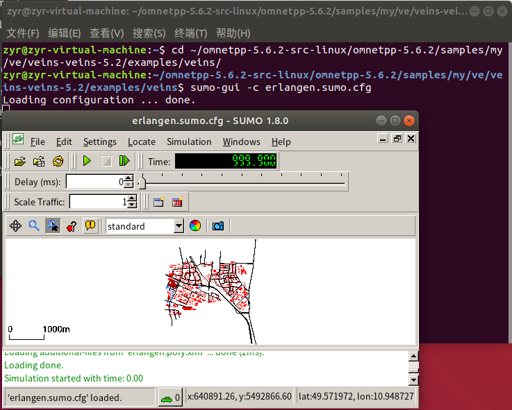

# Veins5.2-Ubuntu18.04-Installation-Guide
- 在Veins官网查看Veins5.2对应OMNeT++、SUMO版本
    
    Veins官网：https://veins.car2x.org/
    

- Ubuntu-18.04-LTS安装
    - Ubuntu安装网址：https://releases.ubuntu.com/
    
    - 下载该镜像文件
    

    - 安装步骤可参考[link](https://blog.csdn.net/m0_47958289/article/details/117361027)。
   
        其中安装VMware Tools工具时，可能会提示`sudo： ./vmware-install.pl`找不到命令,这个问题可能是装的版本的问题，因此下载最新版本可以解决此问题，代码如下：
        ```
        sudo apt-get upgrade  //更新软件下载库，确保下载最新版的软件
        sudo apt-get install open-vm-tools-desktop -y  //在VMware Tools官网上下载最新版本
        sudo reboot           //重启
        ```
- OMNeTpp5.6.2安装
    - 将下载文件拖到Ubuntu中，进入`.../omnetpp-5.6.2/doc/`,参考`installGuide.pdf`中Chapter 5部分。在终端中键入代码如下：
        ```
        sudo apt-get update //更新可用软件包的数据库

        sudo apt-get install build-essential gcc g++ bison flex perl \
        python python3 qt5-default libqt5opengl5-dev tcl-dev tk-dev \
        libxml2-dev zlib1g-dev default-jre doxygen graphviz libwebkitgtk-3.0-0  //安装所需的软件包

        sudo apt-get install openscenegraph-plugin-osgearth libosgearth-dev  //安装osgearth开发包（以及开放场景图）

        sudo apt-get install openmpi-bin libopenmpi-dev  //要启用可选的并行模拟支持，需要安装MPI软件包

        sudo apt-get install libpcap-dev  //pcap

        ```
        按照官方文档安装好依赖库后，根据文档描述，在第四章节Linux chapter里有环境配置和安装OMNeT详细
    -  配置环境并安装omnet
        
        进入`omnetpp-5.6.2`文件
        ```
        cd omnetpp-5.6.2-src-linux/  

        cd omnetpp-5.6.2/
        ```
        
        运行以下命令
        ```
        . setenv

        sudo gedit ~/.bashrc
        ```
        在弹出的文件末尾添加如下一行并保存。save后关闭并重新打开终端，以使更改生效。
        ```
        export PATH=$PATH:/home/zyr/omnetpp-5.6.2-src-linux/omnetpp-5.6.2/bin
        ```
        
        重新进入`omnetpp-5.6.2`文件,输入终端
        ```
        ./configure
        ```
        
        当./configure配置完成后，编译OMNeT++。输入终端
        ```
        make
        ```
        
        显示上述界面则OMNeT安装成功。可以验证示例模拟是否正确运行。例如，可以通过输入以下命令来启动dyna模拟：
        ```
        cd samples/dyna
        ./dyna
        ```
        
        如果希望能够从应用程序启动器或通过桌面快捷方式访问IDE，终端键入：
        ```
        make install-menu-item
        make install-desktop-icon
        ```
        打开OMNeT，安装INET架构
        
- SUMO1.8.0安装
    - 下载SUMO安装包

        以SUMO1.8.0为例，在官网[link](https://sourceforge.net/projects/sumo/files/sumo/)中找到该版本下载
        
        打开环境变量配置文件，终端键入：
        ```
        gedit ~/.bashrc
        ```
        在文件最后加入如下目录地址，根据自己路径进行填写
        ```
        export SUMO_HOME="/home/zyr/sumo-all-1.8.0/sumo-1.8.0"

        export PATH=/home/zyr/sumo-all-1.8.0/sumo-1.8.0/bin:/home/zyr/sumo-all-1.8.0/sumo-1.8.0/tools:$PATH
        ```
        
        保存并退出后通过source使环境变量生效
        ```
        source ~/.bashrc
        ```
        检测是否修改成功
        ```
        echo $SUMO_HOME
        ```
        
    - 安装SUMO依赖库
        ```
        sudo apt-get install libgdal-dev
        sudo apt-get install libproj-dev
        sudo apt-get install libxerces-c-dev
        sudo apt-get install libfox-1.6-dev 
        ```
    - 安装SUMO(plexe-sumo)
        ```
        cd ~/sumo-1.8.0/build/cmake_modules
        sudo apt install cmake
        cmake ../..
        make -j8
        ```
    - 启动SUMO
        ```
        sumo-gui
        ```
        
- Veins5.2安装
    - 官网下载Veins5.2[link](https://veins.car2x.org/download/)
    - 拷贝安装包到Ubuntu的home路径。在`/omnetpp-5.6.2/samples`下新建一个文件夹`my`，在`/omnetpp-5.6.2/samples/my`下建两个文件夹`lte`(存放inet和simiLTE)和`ve`(存放veins)
    - 将Veins安装包解压到`ve`文件夹中
    - 测试安装的SUMO和Veins是否能正常运行
      ```
      cd ~/omnetpp-5.6.2-src-linux/omnetpp-5.6.2/samples/my/ve/veins-veins-5.2/examples/veins/
      
      sumo-gui -c erlangen.sumo.cfg   //测试
      ```
         
    - 进入`veins-veins-5.2`文件，键入
      ```
      ./configure

      make -j$(nproc)

      python2 sumo-launchd.py -vv -c sumo-gui  //代理OMNeT++和SUMO之间的TCP连接
      ```
      
      将在端口9999上打印Listening并等待模拟开始。将此窗口保持打开状态，然后切换回OMNeT++ IDE
    - 导入文件至OMNeT++ IDE，并运行`omnetpp.ini`文件
      
      运行成功！